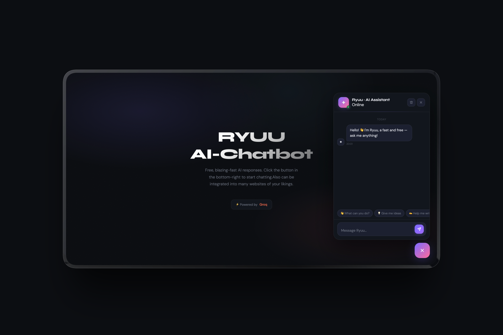

# 🐉 Ryuu — AI Chatbot Powered by Groq

**Ryuu** (竜) means *Dragon* in Japanese — a free, fast, and powerful AI chatbot widget built with **Groq API** (LLaMA 3) and deployed on **Vercel**. As fierce and fast as a dragon, drop it into any website with zero cost.



---

## ✨ Features

- 💬 **Real-time AI chat** powered by Groq's free LLaMA 3.3 70B model
- ⚡ **Blazing fast** responses — Groq is one of the fastest AI inference providers
- 🎨 **Beautiful dark UI** with smooth animations and gradient design
- 📱 **Fully responsive** — works on mobile and desktop
- 🔒 **Secure** — API key is stored server-side, never exposed to the browser
- 🧠 **Conversation memory** — remembers context across messages
- 💡 **Quick suggestion chips** for easy conversation starters
- 🗑️ **Clear chat** button to reset conversation
- 🌐 **Embeddable** on any website

---

## 🗂️ Project Structure

```
vercel-chatbot/
├── api/
│   └── chat.js          ← Vercel serverless function (backend)
├── public/
│   ├── index.html       ← Chat UI (HTML)
│   ├── style.css        ← All styles
│   └── script.js        ← All JavaScript logic
├── vercel.json          ← Vercel configuration
├── package.json         ← Project dependencies
├── .env.example         ← Environment variable template
└── .gitignore
```

---

## 🚀 Quick Start

### Prerequisites
- [Node.js](https://nodejs.org) v18 or higher
- [Vercel CLI](https://vercel.com/cli) — `npm install -g vercel`
- Free [Groq API key](https://console.groq.com)

### 1. Clone the repo
```bash
git clone https://github.com/yourusername/vercel-chatbot.git
cd vercel-chatbot
```

### 2. Set up environment variables
```bash
cp .env.example .env
```

Open `.env` and add your Groq API key:
```env
GROQ_API_KEY=gsk_xxxxxxxxxxxxxxxxxxxxxxxxxxxxxxxxxxxxxxxx
```

### 3. Install dependencies
```bash
npm install
```

### 4. Run locally
```bash
vercel dev
```

Open your browser at:
```
http://localhost:3000
```

---

## ☁️ Deploy to Vercel

### Option 1 — Deploy via GitHub (Recommended)

1. Push your code to GitHub
2. Go to [vercel.com](https://vercel.com) and sign in with GitHub
3. Click **"Add New Project"** and import your repo
4. Go to **Environment Variables** and add:
   - `GROQ_API_KEY` → your Groq API key
5. Click **Deploy** ✅

Your chatbot will be live at:
```
https://your-project-name.vercel.app
```

### Option 2 — Deploy via CLI

```bash
vercel
# Follow the prompts, then:
vercel env add GROQ_API_KEY
vercel --prod
```

---

## 🔧 Configuration

### Change AI Model
Open `api/chat.js` and update the `MODEL` variable:

```javascript
// Available free Groq models:
const MODEL = 'llama-3.3-70b-versatile';  // Best quality ✅
const MODEL = 'llama-3.1-8b-instant';     // Fastest
const MODEL = 'mixtral-8x7b-32768';       // Long conversations
const MODEL = 'gemma2-9b-it';             // Google's model
```

### Change Bot Personality
Update the `SYSTEM_PROMPT` in `api/chat.js`:

```javascript
const SYSTEM_PROMPT = `You are Ryuu, a powerful AI assistant named after the Japanese word for Dragon...`;
```

### Change Backend URL
After deploying to Vercel, update `script.js`:

```javascript
const BACKEND_URL = 'https://your-project.vercel.app/api/chat';
```

---

## 🛠️ Tech Stack

| Layer | Technology |
|---|---|
| Frontend | HTML, CSS, JavaScript (Vanilla) |
| Backend | Vercel Serverless Functions (Node.js) |
| AI Model | LLaMA 3.3 70B via Groq API |
| Deployment | Vercel |
| Fonts | Syne + DM Sans (Google Fonts) |

---

## 📦 API Reference

### `POST /api/chat`

Request body:
```json
{
  "message": "Hello, how are you?",
  "history": [
    { "role": "user", "content": "previous message" },
    { "role": "assistant", "content": "previous reply" }
  ]
}
```

Response:
```json
{
  "reply": "Ryuu is ready! How can I help you today?",
  "model": "llama-3.3-70b-versatile"
}
```

---

## 🌐 Embed on Any Website

Once deployed, add this to any website's HTML:

```html
<!-- Add before </body> -->
<script>
  fetch('https://your-project.vercel.app/api/chat', {
    method: 'POST',
    headers: { 'Content-Type': 'application/json' },
    body: JSON.stringify({ message: 'Hello!', history: [] })
  })
  .then(res => res.json())
  .then(data => console.log(data.reply));
</script>
```

---

## 🔑 Getting a Free Groq API Key

1. Go to [console.groq.com](https://console.groq.com)
2. Sign up — no credit card required
3. Click **"API Keys"** → **"Create API Key"**
4. Copy and save your key
5. Add it to your `.env` file or Vercel environment variables

---

## 📄 License

MIT License — free to use, modify, and distribute.

---

## 🙏 Credits

- [Groq](https://groq.com) — ultra-fast AI inference
- [Meta LLaMA](https://ai.meta.com/llama/) — open source AI model
- [Vercel](https://vercel.com) — serverless deployment platform

---

> 🐉 Ryuu — Named after the Japanese word for Dragon. Fast, fierce, and free forever with Groq's free tier.
